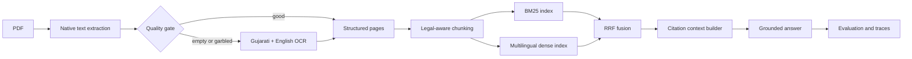

# Atlas Enterprise Document RAG

[](https://github.com/yadavvinay77/atlas-rag-enterprise/actions/workflows/ci.yml)
[](https://github.com/yadavvinay77/atlas-rag-enterprise/actions/workflows/cd.yml)
[](https://www.python.org/)

A portfolio-grade document RAG workspace with PDF upload, local-path ingestion,
background progress, multi-document indexing, cited Q&A, and optional Ollama
generation. It supports both scanned multilingual government records and large
text-native references such as `CURRENT Medical Diagnosis & Treatment 2026`.

## Why not notebook-only?

Notebooks are used for inspection, experiments, and evaluation. Reusable logic
lives in `src/enterprise_rag`, where it can be tested, served through FastAPI,
and moved into batch jobs or containers.

## Architecture



## Quick start

Requires Python 3.11+. For OCR, install Tesseract and Gujarati language data
(`guj`) in addition to English (`eng`).

```powershell
python -m venv .venv
.\.venv\Scripts\Activate.ps1
pip install -e ".[dev]"
Copy-Item .env.example .env

enterprise-rag create-demo-index
enterprise-rag serve

enterprise-rag ingest "C:\Users\yadav\Downloads\gamtad_vadharava_babat_Document.pdf"
enterprise-rag search "ગામતળ વિસ્તાર અંગેનો ઠરાવ"
enterprise-rag serve
```

Open `http://127.0.0.1:8000/docs` for the API. The first dense-search run
downloads the configured multilingual embedding model. Set
`RAG_ENABLE_DENSE=false` to demonstrate the pipeline with BM25 only.
Install dense retrieval later with `pip install -e ".[dense]"`.

## Interactive UI

```powershell
cd C:\Users\yadav\Documents\Projects\RAG_version_1
.\.venv\Scripts\Activate.ps1
enterprise-rag serve
```
```powershell
cd C:\Users\yadav\Documents\Projects\RAG_version_1
.\.venv\Scripts\Activate.ps1
python -m uvicorn enterprise_rag.service:app --host 127.0.0.1 --port 8000
```
Open `http://127.0.0.1:8000`.

1. Use **Source library** to upload a PDF, enter its full path, or enter a
   folder path to ingest all PDFs directly inside that folder.
2. Select **Replace current index** or **Add to library**.
3. Optionally enter a small **Test pages** value before processing a large book.
4. Watch page-level indexing progress.
5. Open **Ask documents**, submit a question, and inspect every cited passage.

## Conversation memory

Atlas keeps up to 12 recent turns for each browser conversation. Short follow-up
questions such as "what diet should we follow for this?" are rewritten with the
active topic before retrieval, and recently cited topic-specific documents are
preferred. The conversation ID survives a browser refresh through session
storage. **Clear** deletes the server-side conversation and starts a new topic.

The medical book supplied for this project has already been indexed locally:
1,967 pages and 10,768 chunks.

The UI is a research interface, not a medical device. It summarizes indexed
material and must not be used to diagnose, prescribe, or replace professional
care.

## Demonstration flow

1. Run `notebooks/01_document_audit.ipynb` to show why OCR routing is needed.
2. Ingest the PDF and inspect `data/processed/pages.jsonl` and `chunks.jsonl`.
3. Create 30-50 bilingual evaluation questions in
   `data/evaluation/questions.jsonl`.
4. Compare BM25, dense, and hybrid retrieval with `enterprise-rag evaluate`.
5. Demonstrate citations and abstention through the FastAPI Swagger UI.

## CI/CD and releases

Pull requests and pushes to `main` run Ruff, the complete pytest suite, Python
package creation, and a Docker build. Successful pushes to `main` publish
`ghcr.io/yadavvinay77/atlas-rag-enterprise:latest`; version tags such as `v0.3.0`
also publish a matching semantic-version image. Dependabot checks Python and
GitHub Actions dependencies weekly.

For future work, create a branch from `main`, use Conventional Commits, and open
a pull request. Release versions are recorded in `pyproject.toml` and
`CHANGELOG.md`; see `CONTRIBUTING.md` for the workflow.

## Enterprise roadmap

| Phase | Portfolio implementation | Production upgrade |
|---|---|---|
| Document intelligence | PyMuPDF + Tesseract quality routing | Docling/PaddleOCR service, layout model, OCR confidence |
| Metadata | Regex-assisted legal metadata | Schema-constrained LLM extraction + validation |
| Storage | Versioned JSONL artifacts | Object storage + catalog + lineage |
| Retrieval | BM25 + multilingual embeddings + RRF | OpenSearch/Qdrant, filters, ACL-aware retrieval |
| Reranking | Extension point | Multilingual cross-encoder |
| Generation | Extractive answer or Ollama | Governed model gateway, prompt/version registry |
| Evaluation | Recall, MRR, citation coverage | Golden set, LLM judges, regression gates |
| Operations | FastAPI, structured logs | SSO/RBAC, audit trail, tracing, dashboards |

## What to discuss in an interview

- Native extraction is rejected when text is empty or appears legacy-encoded.
- OCR provenance is retained per page; low-quality pages are auditable.
- Child chunks retrieve precisely while parent/page metadata preserves context.
- Hybrid retrieval uses Reciprocal Rank Fusion instead of incomparable raw scores.
- Answers are citation-first and abstain when evidence is weak.
- The evaluation set is bilingual so Gujarati and English queries must retrieve
  the same authoritative passages.
